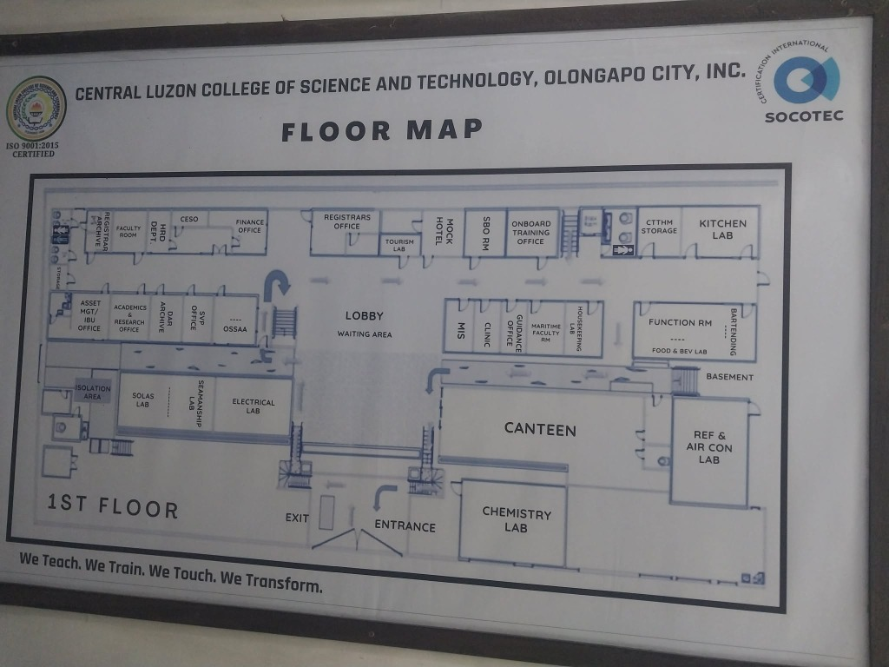

# System Development Approaches
## V.I.R.A. - CeltechVoice Application

### Overview
This document outlines the development approaches, methodologies, architectural patterns, and best practices used in building the V.I.R.A. (Virtual Interactive Resource Assistant) text-to-speech application for Celtech College Olongapo.

---

## Table of Contents
1. [Development Methodology](#development-methodology)
2. [Architectural Approach](#architectural-approach)
3. [Technology Stack](#technology-stack)
4. [Design Patterns](#design-patterns)
5. [Development Phases](#development-phases)
6. [Code Organization](#code-organization)
7. [Testing Approach](#testing-approach)
8. [Deployment Strategy](#deployment-strategy)
9. [Maintenance and Evolution](#maintenance-and-evolution)
10. [Best Practices](#best-practices)

---

## 1. Development Methodology

### Agile Development Approach

The V.I.R.A. project follows an **Agile iterative development** methodology with the following characteristics:

#### 1.1 Iterative Development Cycles

**Sprint Structure:**
- **Sprint Duration:** 1-2 weeks
- **Sprint Planning:** Define features and user stories
- **Daily Progress:** Continuous development and testing
- **Sprint Review:** Demo working features
- **Sprint Retrospective:** Identify improvements

**Iteration Phases:**
```
Phase 1: Core TTS Functionality (Week 1-2)
├── Basic UI structure
├── Text-to-speech integration
├── Content display system
└── Theme management

Phase 2: Enhanced Features (Week 3-4)
├── Voice search integration
├── Advanced search functionality
├── Category-based filtering
└── Responsive design

Phase 3: Interactive Maps (Week 5-6)
├── Campus navigation system
├── Floor plan integration
├── Location search
└── Interactive markers

Phase 4: PWA and Optimization (Week 7-8)
├── Service worker implementation
├── Offline functionality
├── Performance optimization
└── Mobile optimization

Phase 5: Branding and Polish (Week 9-10)
├── V.I.R.A. branding integration
├── UI/UX refinements
├── Accessibility improvements
└── Final testing and deployment
```

#### 1.2 User-Centered Design

**Approach:**
- **User Research:** Understand student and faculty needs
- **Personas:** Define target users (students, visitors, staff)
- **User Stories:** Feature development based on user needs
- **Usability Testing:** Continuous feedback and iteration

**Sample User Stories:**
```
As a student, I want to hear school announcements read aloud 
so that I can multitask while staying informed.

As a visitor, I want to find campus locations easily 
so that I can navigate the building without getting lost.

As a faculty member, I want to access school history information 
so that I can share it with students.

As a visually impaired user, I want voice-controlled navigation 
so that I can use the app independently.
```

#### 1.3 Continuous Integration and Delivery

**CI/CD Pipeline:**
```
Code Development → Version Control (Git) → 
Code Review → Testing → Build → 
Deployment → Monitoring → Feedback
```

**Tools and Practices:**
- **Version Control:** Git with feature branches
- **Code Review:** Pull request reviews before merge
- **Automated Testing:** Manual testing for each feature
- **Deployment:** Netlify for continuous deployment
- **Monitoring:** Browser console logs and user feedback

---

## 2. Architectural Approach

### 2.1 Client-Side Architecture

**Architecture Type:** **Single Page Application (SPA)**

**Rationale:**
- No backend server required
- Fast, responsive user experience
- Offline-capable with PWA
- Cost-effective (no server costs)
- Easy deployment and maintenance

**Architecture Diagram:**
```
┌─────────────────────────────────────────────────────────┐
│                     PRESENTATION LAYER                  │
│  ┌──────────────┐  ┌──────────────┐  ┌──────────────┐  │
│  │   HTML/CSS   │  │  JavaScript  │  │  Web Speech  │  │
│  │     (UI)     │  │   (Logic)    │  │     API      │  │
│  └──────────────┘  └──────────────┘  └──────────────┘  │
└─────────────────────────────────────────────────────────┘
                            │
                            ▼
┌─────────────────────────────────────────────────────────┐
│                     APPLICATION LAYER                   │
│  ┌──────────────┐  ┌──────────────┐  ┌──────────────┐  │
│  │    Search    │  │     TTS      │  │    Voice     │  │
│  │    Engine    │  │    Engine    │  │  Assistant   │  │
│  └──────────────┘  └──────────────┘  └──────────────┘  │
│  ┌──────────────┐  ┌──────────────┐  ┌──────────────┐  │
│  │   Content    │  │    Theme     │  │  Navigation  │  │
│  │   Manager    │  │   Manager    │  │    System    │  │
│  └──────────────┘  └──────────────┘  └──────────────┘  │
└─────────────────────────────────────────────────────────┘
                            │
                            ▼
┌─────────────────────────────────────────────────────────┐
│                       DATA LAYER                        │
│  ┌──────────────┐  ┌──────────────┐  ┌──────────────┐  │
│  │  School Data │  │    User      │  │  Navigation  │  │
│  │   (data.js)  │  │ Preferences  │  │     Data     │  │
│  │              │  │(LocalStorage)│  │(navigation.js)│  │
│  └──────────────┘  └──────────────┘  └──────────────┘  │
└─────────────────────────────────────────────────────────┘
                            │
                            ▼
┌─────────────────────────────────────────────────────────┐
│                    INFRASTRUCTURE LAYER                 │
│  ┌──────────────┐  ┌──────────────┐  ┌──────────────┐  │
│  │    Browser   │  │   Service    │  │     PWA      │  │
│  │     APIs     │  │    Worker    │  │   Manifest   │  │
│  └──────────────┘  └──────────────┘  └──────────────┘  │
└─────────────────────────────────────────────────────────┘
```

### 2.2 Progressive Web App (PWA) Approach

**PWA Features Implemented:**

1. **Offline Functionality**
   - Service worker caches static assets
   - App works without internet connection
   - Background sync for future updates

2. **Installability**
   - Web app manifest (manifest.json)
   - Add to home screen capability
   - Native app-like experience

3. **Responsive Design**
   - Mobile-first approach
   - Adaptive layouts for all screen sizes
   - Touch-friendly interface

4. **Performance Optimization**
   - Fast load times
   - Efficient caching strategies
   - Lazy loading of resources

**Service Worker Strategy:**
```javascript
// Cache-First Strategy
self.addEventListener('fetch', (event) => {
  event.respondWith(
    caches.match(event.request)
      .then(response => response || fetch(event.request))
  );
});
```

### 2.3 Modular Architecture

**Module Organization:**
```
V.I.R.A. Application
├── Core Modules
│   ├── App Initialization (init)
│   ├── State Management (application state)
│   └── Event Handling (user interactions)
│
├── Feature Modules
│   ├── Search Module (search engine)
│   ├── TTS Module (text-to-speech)
│   ├── Voice Module (voice assistant)
│   ├── Content Module (content display)
│   ├── Theme Module (theme management)
│   └── Navigation Module (interactive maps)
│
├── Data Modules
│   ├── School Data (data.js)
│   ├── Navigation Data (navigation.js)
│   └── Language Config (language-config.js)
│
└── Infrastructure Modules
    ├── Service Worker (sw.js)
    ├── PWA Manifest (manifest.json)
    └── Styles (styles.css)
```

---

## 3. Technology Stack

### 3.1 Frontend Technologies

**Core Technologies:**
- **HTML5:** Semantic markup, accessibility features
- **CSS3:** Modern styling, animations, responsive design
- **JavaScript (ES6+):** Application logic, DOM manipulation

**Why Vanilla JavaScript?**
- No framework dependencies
- Faster load times
- Smaller bundle size
- Direct control over performance
- Easier maintenance for small team

**CSS Architecture:**
```css
/* CSS Custom Properties for theming */
:root {
  --primary-color: #1e5a8e;
  --secondary-color: #f39c12;
  --accent-color: #27ae60;
  /* ... */
}

/* Dark theme overrides */
[data-theme="dark"] {
  --bg-color: #1a1a2e;
  --text-color: #eaeaea;
  /* ... */
}
```

### 3.2 Browser APIs

**Web Speech API:**
- **Speech Synthesis:** Text-to-speech conversion
- **Speech Recognition:** Voice command input

**LocalStorage API:**
- User preferences persistence
- Theme settings
- Search history

**Service Worker API:**
- Offline functionality
- Caching strategies
- Background sync

**Geolocation API (Future):**
- Campus location services
- Proximity-based features

### 3.3 Development Tools

**Code Editor:** Visual Studio Code
**Version Control:** Git
**Hosting:** Netlify
**Testing:** Manual testing, browser DevTools
**Design:** Figma (for mockups)
**Documentation:** Markdown

---

## 4. Design Patterns

### 4.1 Module Pattern

**Implementation:**
```javascript
// Encapsulation of related functionality
const SearchModule = (function() {
  // Private variables
  let searchResults = [];
  
  // Private functions
  function filterData(query) {
    // Search logic
  }
  
  // Public API
  return {
    search: function(query) {
      return filterData(query);
    }
  };
})();
```

### 4.2 Observer Pattern

**Event-Driven Architecture:**
```javascript
// Event listeners for user interactions
elements.searchInput.addEventListener('input', handleSearch);
elements.voiceSearchBtn.addEventListener('click', startVoiceSearch);
elements.themeToggle.addEventListener('click', toggleTheme);
```

### 4.3 Singleton Pattern

**Application State:**
```javascript
// Single source of truth for application state
let currentCategory = 'events';
let currentText = '';
let isPlaying = false;
// Only one instance of state throughout the app
```

### 4.4 Factory Pattern

**Card Generation:**
```javascript
function createContentCard(item, index) {
  // Factory function to create consistent card elements
  const card = document.createElement('div');
  card.className = 'content-card';
  // ... build card structure
  return card;
}
```

### 4.5 Strategy Pattern

**Search Strategies:**
```javascript
// Different search strategies based on query type
function handleSearch() {
  const query = searchInput.value.toLowerCase();
  
  // Strategy 1: Special page search
  if (query.includes('map') || query.includes('interactive')) {
    return showSpecialPage('maps');
  }
  
  // Strategy 2: Content search
  return searchContent(query);
}
```

---

## 5. Development Phases

### Phase 1: Planning and Design (Week 1)

**Activities:**
- Requirements gathering
- User research
- Wireframing and mockups
- Technology selection
- Architecture design

**Deliverables:**
- Requirements document
- UI/UX mockups
- Technical architecture diagram
- Project timeline

### Phase 2: Core Development (Week 2-4)

**Activities:**
- HTML structure implementation
- CSS styling and theming
- Basic JavaScript functionality
- TTS integration
- Content display system

**Deliverables:**
- Working prototype
- Basic TTS functionality
- Responsive UI
- Theme switching

### Phase 3: Feature Enhancement (Week 5-6)

**Activities:**
- Voice search implementation
- Advanced search functionality
- Interactive maps development
- Navigation system

**Deliverables:**
- Voice assistant feature
- Campus navigation system
- Enhanced search capabilities

### Phase 4: PWA Implementation (Week 7)

**Activities:**
- Service worker development
- Manifest creation
- Offline functionality
- Performance optimization

**Deliverables:**
- Installable PWA
- Offline capability
- Optimized performance

### Phase 5: Testing and Refinement (Week 8-9)

**Activities:**
- Cross-browser testing
- Mobile device testing
- Accessibility testing
- Performance testing
- Bug fixes

**Deliverables:**
- Test reports
- Bug fixes
- Performance improvements

### Phase 6: Deployment and Launch (Week 10)

**Activities:**
- Production deployment
- Documentation
- User training
- Launch announcement

**Deliverables:**
- Live application
- User documentation
- Deployment guide
- Maintenance plan

---

## 6. Code Organization

### 6.1 File Structure

```
school-tts/
├── index.html              # Main application page
├── navigation.html         # Interactive maps page
├── guide.html             # Installation guide
│
├── app.js                 # Main application logic
├── data.js                # School data (events, history, etc.)
├── navigation.js          # Navigation system logic
├── language-config.js     # Multi-language support
│
├── styles.css             # Main stylesheet
│
├── sw.js                  # Service worker
├── manifest.json          # PWA manifest
│
├── celtech_logo.png       # School logo
├── floor_1st.jpg          # Floor plan images
├── floor_2nd.jpg
├── floor_3rd.jpg
├── floor_4th.jpg
│
├── netlify.toml           # Deployment configuration
├── deploy.ps1             # Deployment script
│
└── Documentation/
    ├── README.md
    ├── DEPLOYMENT.md
    ├── TESTING_GUIDE.md
    ├── ERD_DIAGRAM.md
    ├── DFD_DIAGRAM.md
    └── APPROACHES.md
```

### 6.2 Code Style Guidelines

**JavaScript Conventions:**
```javascript
// Use camelCase for variables and functions
let currentCategory = 'events';
function renderContent(category) { }

// Use PascalCase for constructors (if any)
function ContentCard(data) { }

// Use UPPER_CASE for constants
const MAX_SEARCH_RESULTS = 50;

// Use descriptive names
// Good: getUserPreferences()
// Bad: getUP()

// Comment complex logic
// Calculate progress percentage based on character position
const progress = (charIndex / totalChars) * 100;
```

**CSS Conventions:**
```css
/* Use BEM-like naming for clarity */
.content-card { }
.content-card__title { }
.content-card__content { }
.content-card--highlighted { }

/* Group related properties */
.element {
  /* Positioning */
  position: relative;
  top: 0;
  
  /* Box model */
  width: 100%;
  padding: 1rem;
  
  /* Typography */
  font-size: 1rem;
  color: var(--text-color);
  
  /* Visual */
  background: var(--bg-color);
  border-radius: var(--radius-md);
  
  /* Animation */
  transition: all 0.3s ease;
}
```

### 6.3 Code Modularity

**Separation of Concerns:**
```javascript
// ==================== Application State ====================
// State variables grouped together

// ==================== Initialization ====================
// Initialization logic

// ==================== Theme Management ====================
// Theme-related functions

// ==================== Voice Management ====================
// Voice-related functions

// ==================== Content Rendering ====================
// Content display functions

// ==================== TTS Panel Management ====================
// TTS control functions

// ==================== Speech Synthesis ====================
// Speech synthesis functions

// ==================== Voice Search ====================
// Voice search functions

// ==================== Event Listeners ====================
// Event handling
```

---

## 7. Testing Approach

### 7.1 Testing Strategy

**Testing Pyramid:**
```
        ┌─────────────┐
        │   Manual    │  ← User Acceptance Testing
        │   Testing   │
        └─────────────┘
       ┌───────────────┐
       │  Integration  │  ← Feature Testing
       │    Testing    │
       └───────────────┘
      ┌─────────────────┐
      │  Unit Testing   │  ← Function Testing
      │  (Manual/Auto)  │
      └─────────────────┘
```

### 7.2 Testing Types

#### Unit Testing
**Approach:** Manual testing of individual functions
**Focus Areas:**
- Search algorithm accuracy
- TTS playback controls
- Theme switching
- Voice recognition
- Data filtering

**Example Test Cases:**
```
Test: Search Function
- Input: "library"
- Expected: Return all items containing "library"
- Actual: [fac8: School Library...]
- Status: PASS

Test: Theme Toggle
- Input: Click theme button (current: light)
- Expected: Switch to dark theme, update localStorage
- Actual: Theme changed, localStorage updated
- Status: PASS
```

#### Integration Testing
**Approach:** Test feature workflows
**Focus Areas:**
- Search → Display → TTS flow
- Voice command → Action execution
- Category switch → Content update
- Map navigation → Location display

**Example Test Cases:**
```
Test: Complete TTS Workflow
1. User clicks on event card
2. TTS panel opens with content
3. User clicks play button
4. Speech synthesis starts
5. Progress bar animates
6. Speech completes
7. UI resets
Status: PASS
```

#### Cross-Browser Testing
**Browsers Tested:**
- Chrome (Desktop & Mobile)
- Firefox (Desktop & Mobile)
- Safari (Desktop & Mobile)
- Edge (Desktop)

**Test Matrix:**
```
Feature              | Chrome | Firefox | Safari | Edge
---------------------|--------|---------|--------|------
TTS Playback         |   ✓    |    ✓    |   ✓    |  ✓
Voice Search         |   ✓    |    ✓    |   ✗    |  ✓
Theme Switching      |   ✓    |    ✓    |   ✓    |  ✓
Offline Mode         |   ✓    |    ✓    |   ✓    |  ✓
Responsive Design    |   ✓    |    ✓    |   ✓    |  ✓
```

#### Mobile Testing
**Devices Tested:**
- iPhone (iOS Safari)
- Android (Chrome)
- Tablet (iPad, Android)

**Mobile-Specific Tests:**
- Touch interactions
- Screen rotation
- PWA installation
- Offline functionality
- Performance on mobile networks

### 7.3 Accessibility Testing

**WCAG 2.1 Compliance:**
- Keyboard navigation
- Screen reader compatibility
- Color contrast ratios
- Focus indicators
- ARIA labels

**Tools Used:**
- Chrome DevTools Lighthouse
- WAVE accessibility checker
- Keyboard-only navigation testing

### 7.4 Performance Testing

**Metrics Monitored:**
- Page load time (< 2 seconds)
- Time to interactive (< 3 seconds)
- First contentful paint (< 1 second)
- Largest contentful paint (< 2.5 seconds)

**Tools:**
- Chrome DevTools Performance tab
- Lighthouse performance audit
- Network throttling tests

---

## 8. Deployment Strategy

### 8.1 Deployment Approach

**Platform:** Netlify (Continuous Deployment)

**Deployment Workflow:**
```
Local Development → Git Commit → Git Push → 
GitHub Repository → Netlify Build → 
Automatic Deployment → Live Site
```

### 8.2 Deployment Configuration

**netlify.toml:**
```toml
[build]
  publish = "."
  command = "echo 'No build step required'"

[[redirects]]
  from = "/*"
  to = "/index.html"
  status = 200
```

### 8.3 Environment Management

**Environments:**
1. **Development:** Local machine
2. **Staging:** Netlify preview deployments
3. **Production:** Main Netlify deployment

**Branch Strategy:**
```
main (production)
├── develop (staging)
│   ├── feature/search-enhancement
│   ├── feature/voice-assistant
│   └── bugfix/tts-playback
```

### 8.4 Rollback Strategy

**Approach:**
- Netlify maintains deployment history
- One-click rollback to previous version
- Git revert for code-level rollback

---

## 9. Maintenance and Evolution

### 9.1 Maintenance Approach

**Regular Maintenance Tasks:**
- Content updates (events, facilities)
- Bug fixes
- Security updates
- Performance optimization
- Browser compatibility updates

**Maintenance Schedule:**
```
Daily:    Monitor user feedback
Weekly:   Review analytics, check for bugs
Monthly:  Update content, performance review
Quarterly: Major feature updates, security audit
```

### 9.2 Evolution Strategy

**Future Enhancements:**

**Phase 1: Backend Integration**
- Implement database (Firebase/Supabase)
- Admin panel for content management
- User authentication
- Real-time updates

**Phase 2: Advanced Features**
- Multi-language support (Filipino, Spanish)
- AI-powered chatbot
- Personalized recommendations
- Push notifications

**Phase 3: Analytics and Insights**
- User behavior tracking
- Popular content analytics
- Search query analysis
- Performance metrics dashboard

**Phase 4: Integration**
- Integration with school management system
- Calendar synchronization
- Student portal integration
- Social media integration

### 9.3 Scalability Considerations

**Current Limitations:**
- Client-side data (limited to ~1000 items)
- No user accounts
- No real-time updates
- Limited analytics

**Scaling Solutions:**
- Migrate to database for larger datasets
- Implement server-side rendering for SEO
- Add CDN for global performance
- Implement caching strategies

---

## 10. Best Practices

### 10.1 Code Quality

**Principles:**
- **DRY (Don't Repeat Yourself):** Reusable functions
- **KISS (Keep It Simple, Stupid):** Simple, readable code
- **YAGNI (You Aren't Gonna Need It):** No over-engineering
- **Separation of Concerns:** Modular code organization

**Code Review Checklist:**
- [ ] Code is readable and well-commented
- [ ] No console errors or warnings
- [ ] Functions are single-purpose
- [ ] Variables have descriptive names
- [ ] No hardcoded values (use constants)
- [ ] Error handling implemented
- [ ] Performance optimized

### 10.2 Performance Best Practices

**Optimization Techniques:**
1. **Minimize DOM Manipulation**
   ```javascript
   // Bad: Multiple DOM updates
   items.forEach(item => {
     container.appendChild(createCard(item));
   });
   
   // Good: Single DOM update
   const fragment = document.createDocumentFragment();
   items.forEach(item => {
     fragment.appendChild(createCard(item));
   });
   container.appendChild(fragment);
   ```

2. **Debounce User Input**
   ```javascript
   // Debounce search to avoid excessive processing
   let searchTimeout;
   searchInput.addEventListener('input', () => {
     clearTimeout(searchTimeout);
     searchTimeout = setTimeout(handleSearch, 300);
   });
   ```

3. **Lazy Loading**
   ```javascript
   // Load images only when needed
   
   ```

4. **CSS Optimization**
   ```css
   /* Use CSS transforms for animations (GPU accelerated) */
   .card {
     transform: translateY(0);
     transition: transform 0.3s ease;
   }
   .card:hover {
     transform: translateY(-5px);
   }
   ```

### 10.3 Security Best Practices

**Client-Side Security:**
1. **Input Sanitization**
   ```javascript
   function sanitizeInput(input) {
     return input.trim().toLowerCase();
   }
   ```

2. **XSS Prevention**
   ```javascript
   // Use textContent instead of innerHTML for user input
   element.textContent = userInput; // Safe
   // element.innerHTML = userInput; // Unsafe
   ```

3. **Content Security Policy**
   ```html
   <meta http-equiv="Content-Security-Policy" 
         content="default-src 'self'; script-src 'self';">
   ```

### 10.4 Accessibility Best Practices

**WCAG Guidelines:**
1. **Semantic HTML**
   ```html
   <header>, <nav>, <main>, <section>, <article>, <footer>
   ```

2. **ARIA Labels**
   ```html
   <button aria-label="Play audio" id="playBtn">
     <svg>...</svg>
   </button>
   ```

3. **Keyboard Navigation**
   ```javascript
   // Ensure all interactive elements are keyboard accessible
   element.addEventListener('keydown', (e) => {
     if (e.key === 'Enter' || e.key === ' ') {
       handleClick();
     }
   });
   ```

4. **Color Contrast**
   ```css
   /* Ensure 4.5:1 contrast ratio for text */
   color: #333; /* on white background */
   ```

### 10.5 Documentation Best Practices

**Code Documentation:**
```javascript
/**
 * Renders content cards for the selected category
 * @param {string} category - The category to display (events, history, etc.)
 * @returns {void}
 */
function renderContent(category) {
  // Implementation
}
```

**User Documentation:**
- README with quick start guide
- Deployment guide
- Testing guide
- FAQ section
- Troubleshooting guide

---

## Summary

The V.I.R.A. application employs a **modern, user-centered development approach** with the following key characteristics:

### Development Philosophy
✓ **Agile and Iterative:** Continuous improvement based on feedback  
✓ **User-Centered:** Features driven by user needs  
✓ **Progressive Enhancement:** Core functionality works everywhere, enhanced features where supported  
✓ **Accessibility First:** Inclusive design for all users  
✓ **Performance Focused:** Fast, responsive, efficient  

### Technical Approach
✓ **Client-Side Architecture:** No server required, fast and cost-effective  
✓ **PWA Implementation:** Offline-capable, installable, app-like experience  
✓ **Vanilla JavaScript:** No framework dependencies, lightweight and fast  
✓ **Modular Design:** Organized, maintainable, scalable code  
✓ **Modern Web APIs:** Leveraging browser capabilities (Web Speech, Service Workers)  

### Quality Assurance
✓ **Comprehensive Testing:** Unit, integration, cross-browser, accessibility  
✓ **Performance Optimization:** Fast load times, efficient rendering  
✓ **Security Conscious:** Input validation, XSS prevention  
✓ **Well Documented:** Code comments, user guides, technical documentation  

### Deployment and Maintenance
✓ **Continuous Deployment:** Automated deployment via Netlify  
✓ **Version Control:** Git-based workflow with feature branches  
✓ **Regular Updates:** Content updates, bug fixes, feature enhancements  
✓ **Scalability Planning:** Architecture supports future growth  

---

## Conclusion

The V.I.R.A. project demonstrates a **pragmatic, modern approach** to web application development that prioritizes:

1. **User Experience:** Intuitive, accessible, fast
2. **Code Quality:** Clean, maintainable, well-documented
3. **Performance:** Optimized for speed and efficiency
4. **Accessibility:** Inclusive design for all users
5. **Maintainability:** Easy to update and extend
6. **Scalability:** Architecture supports future growth

This approach has resulted in a **robust, user-friendly application** that serves the Celtech College community effectively while maintaining high standards of code quality and user experience.

---

**Document Version:** 1.0  
**Last Updated:** February 3, 2026  
**Author:** V.I.R.A. Development Team  
**Contact:** info@clcst.com.ph
