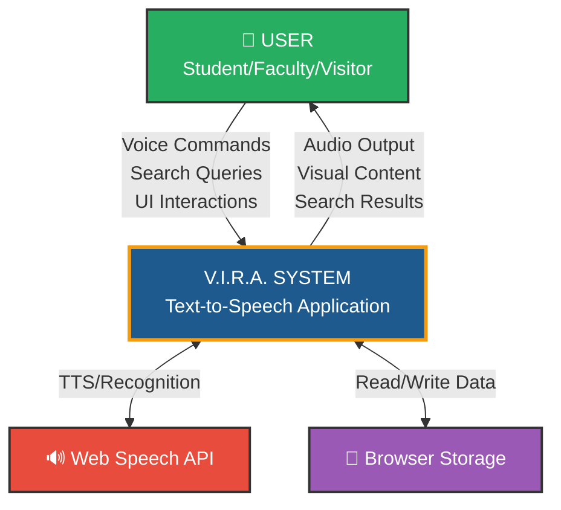
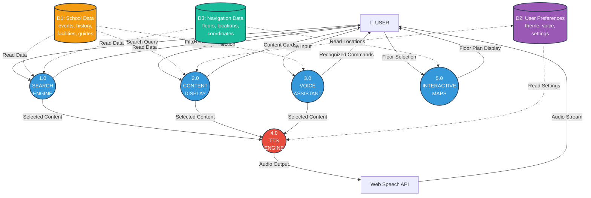
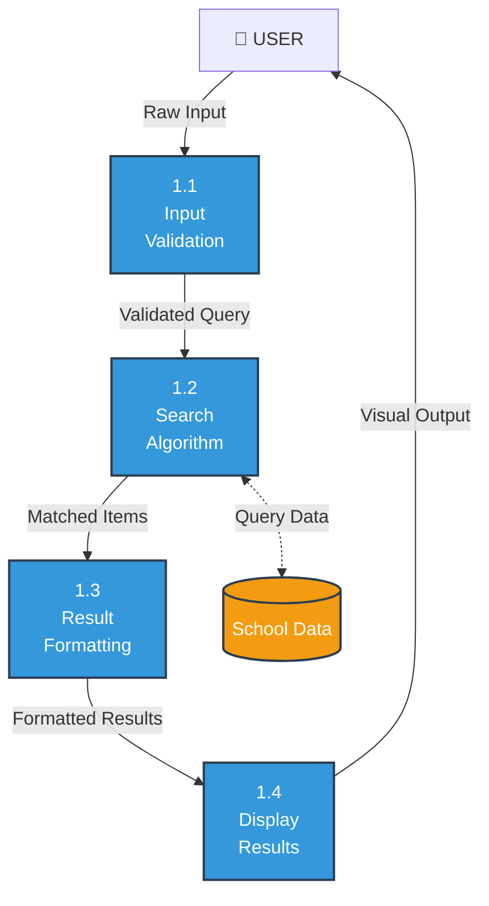
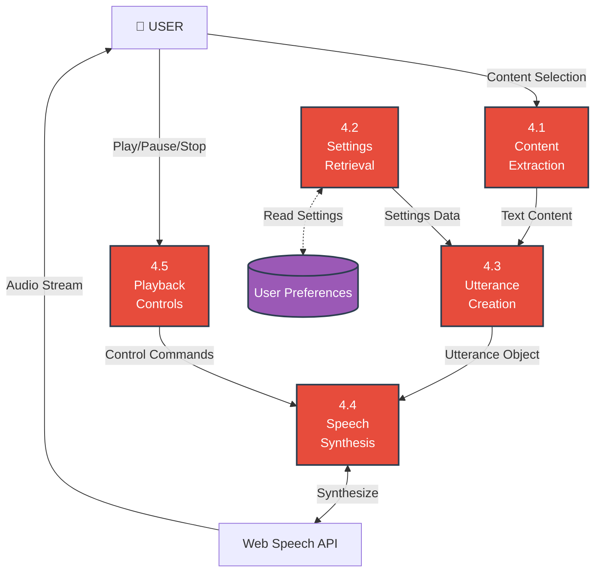
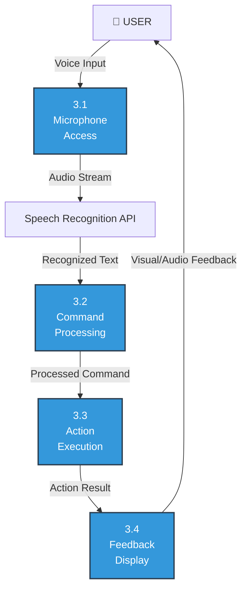
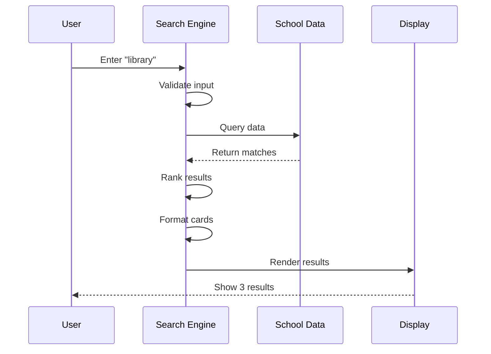
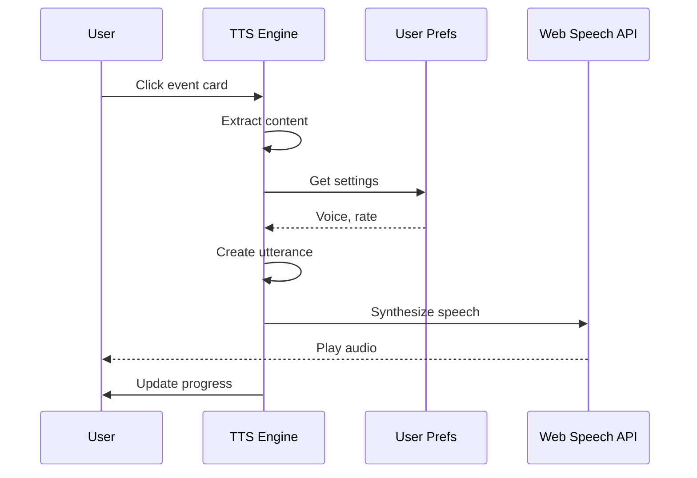
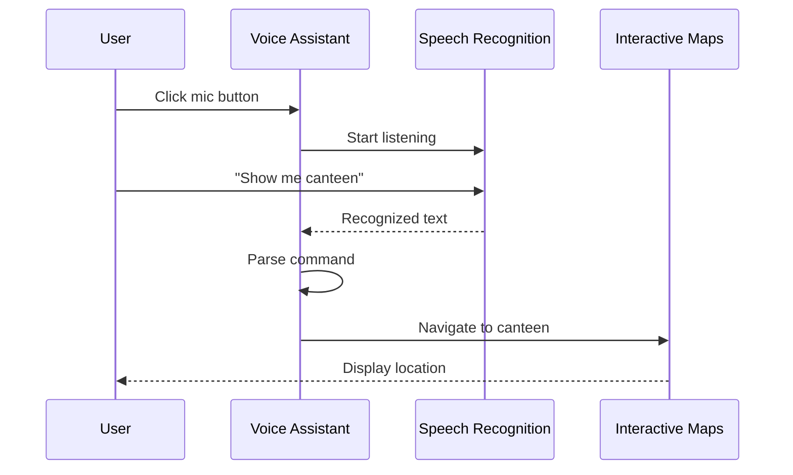

# V.I.R.A. System - DFD Diagram (Mermaid Format)
## Data Flow Diagram

This file contains the DFD in Mermaid diagram format.
You can visualize it at: https://mermaid.live/

## Context Diagram (Level 0)

## Level 1 DFD - Main Processes

## Level 2 DFD - Search Engine Process (1.0)

## Level 2 DFD - TTS Engine Process (4.0)

## Level 2 DFD - Voice Assistant Process (3.0)

## Data Flow Examples

### Example 1: Search Flow

### Example 2: TTS Playback Flow

### Example 3: Voice Command Flow

## Process Summary Table

| Process ID | Name | Inputs | Outputs | Data Stores |
|------------|------|--------|---------|-------------|
| 1.0 | Search Engine | Search query | Filtered results | D1, D3 |
| 2.0 | Content Display | Category selection | Content cards | D1, D2 |
| 3.0 | Voice Assistant | Voice input | Recognized commands | - |
| 4.0 | TTS Engine | Text content | Audio output | D2 |
| 5.0 | Interactive Maps | Floor selection | Floor plan display | D3 |

## Data Store Details

| Store ID | Name | Contents | Access Type |
|----------|------|----------|-------------|
| D1 | School Data | events, history, facilities, campus_guide | Read-only |
| D2 | User Preferences | theme, voiceId, speechRate, lastCategory | Read/Write |
| D3 | Navigation Data | floors, locations, coordinates | Read-only |

---

**How to Visualize:**
1. Copy any Mermaid code block above
2. Go to https://mermaid.live/
3. Paste the code
4. View the interactive diagram
5. Export as PNG/SVG

**Alternative Tools:**
- VS Code with Mermaid extension
- GitHub (supports Mermaid in markdown)
- Draw.io (import Mermaid)
- Confluence (Mermaid plugin)

---

**Document Version:** 1.0  
**Last Updated:** February 15, 2026  
**Author:** V.I.R.A. Development Team
