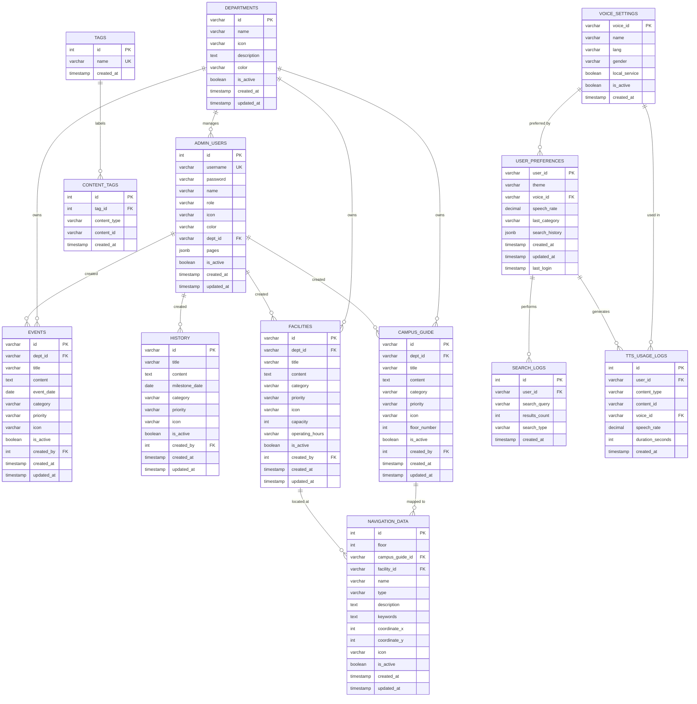

# V.I.R.A. System — ERD Diagram (Mermaid Format)
## Entity Relationship Diagram — v3.0 (Fully Relational)

Visualize at: https://mermaid.live/

---

## Relationship Summary

### 🔗 Foreign Key Constraints (Enforced)

| # | Child Table | FK Column | Parent Table | Parent Column | On Delete |
|---|-------------|-----------|--------------|---------------|-----------|
| 1 | `admin_users`    | `dept_id`          | `departments`      | `id`       | SET NULL  |
| 2 | `events`         | `dept_id`          | `departments`      | `id`       | RESTRICT  |
| 3 | `events`         | `created_by`       | `admin_users`      | `id`       | SET NULL  |
| 4 | `history`        | `created_by`       | `admin_users`      | `id`       | SET NULL  |
| 5 | `facilities`     | `dept_id`          | `departments`      | `id`       | RESTRICT  |
| 6 | `facilities`     | `created_by`       | `admin_users`      | `id`       | SET NULL  |
| 7 | `campus_guide`   | `dept_id`          | `departments`      | `id`       | SET NULL  |
| 8 | `campus_guide`   | `created_by`       | `admin_users`      | `id`       | SET NULL  |
| 9 | `navigation_data`| `campus_guide_id`  | `campus_guide`     | `id`       | SET NULL  |
|10 | `navigation_data`| `facility_id`      | `facilities`       | `id`       | SET NULL  |
|11 | `content_tags`   | `tag_id`           | `tags`             | `id`       | CASCADE   |
|12 | `user_preferences`| `voice_id`        | `voice_settings`   | `voice_id` | SET NULL  |
|13 | `search_logs`    | `user_id`          | `user_preferences` | `user_id`  | SET NULL  |
|14 | `tts_usage_logs` | `user_id`          | `user_preferences` | `user_id`  | SET NULL  |
|15 | `tts_usage_logs` | `voice_id`         | `voice_settings`   | `voice_id` | SET NULL  |

---

## Relationship Types

| Type | Description | Example |
|------|-------------|---------|
| `1:N` (One-to-Many) | One department owns many events | `DEPARTMENTS → EVENTS` |
| `N:1` (Many-to-One) | Many events belong to one dept | `EVENTS → DEPARTMENTS` |
| `M:N` (Many-to-Many) | Content can have many tags; tags apply to many content | `CONTENT ↔ TAGS` via `CONTENT_TAGS` |
| Polymorphic | `content_tags.content_id` references different tables depending on `content_type` | `CONTENT_TAGS → EVENTS \| HISTORY \| FACILITIES \| CAMPUS_GUIDE` |

---

## Database Statistics

| Category | Tables | Description |
|----------|--------|-------------|
| **Root** | 1 | `departments` |
| **Auth** | 1 | `admin_users` |
| **Content** | 4 | `events`, `history`, `facilities`, `campus_guide` |
| **Navigation** | 1 | `navigation_data` |
| **Taxonomy** | 2 | `tags`, `content_tags` |
| **User** | 2 | `user_preferences`, `voice_settings` |
| **Analytics** | 2 | `search_logs`, `tts_usage_logs` |
| **Total** | **13** | — |

---

## Views

| View | Description |
|------|-------------|
| `active_events` | Upcoming events **joined** with department name + creator |
| `popular_facilities` | Facilities ranked by TTS play count, **joined** with department |
| `navigation_by_floor` | Floor map summary **joined** with linked guide titles |
| `search_analytics` | Top searches ranked by frequency + unique user count |
| `dept_content_summary` | How many events/facilities/guides each department published |
| `tts_analytics` | TTS play counts per content type and voice used |

---

## Functions

| Function | Description |
|----------|-------------|
| `search_content(text)` | Full-text ILIKE search across all 4 content tables, returns dept info |
| `get_floor_navigation(int)` | Returns navigation map points for a floor **with guide + facility links** |
| `get_department_content(dept_id)` | Returns all content (events + facilities + guides) for a department |
| `log_tts_usage(...)` | Convenience wrapper to insert a TTS analytics record |

---

**Version:** 3.0 — Fully Relational  
**Updated:** March 24, 2026
