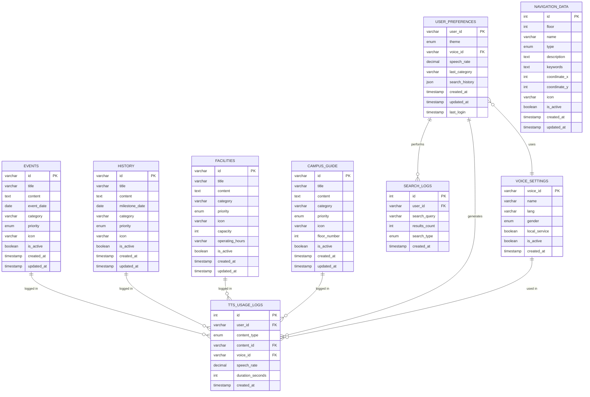

# V.I.R.A. System - ERD Diagram (Mermaid Format)
## Entity Relationship Diagram

This file contains the ERD in Mermaid diagram format.
You can visualize it at: https://mermaid.live/

## Relationship Details

### One-to-Many Relationships

1. **EVENTS → TTS_USAGE_LOGS** (1:N)
   - One event can be played multiple times
   - Each TTS log references one event

2. **HISTORY → TTS_USAGE_LOGS** (1:N)
   - One history item can be played multiple times
   - Each TTS log references one history item

3. **FACILITIES → TTS_USAGE_LOGS** (1:N)
   - One facility can be played multiple times
   - Each TTS log references one facility

4. **CAMPUS_GUIDE → TTS_USAGE_LOGS** (1:N)
   - One guide item can be played multiple times
   - Each TTS log references one guide item

5. **USER_PREFERENCES → SEARCH_LOGS** (1:N)
   - One user can perform multiple searches
   - Each search log belongs to one user

6. **USER_PREFERENCES → TTS_USAGE_LOGS** (1:N)
   - One user can generate multiple TTS sessions
   - Each TTS log belongs to one user

7. **VOICE_SETTINGS → TTS_USAGE_LOGS** (1:N)
   - One voice can be used in multiple TTS sessions
   - Each TTS log uses one voice

### Many-to-One Relationships

8. **USER_PREFERENCES → VOICE_SETTINGS** (N:1)
   - Multiple users can use the same voice
   - Each user has one active voice preference

## Cardinality Notation

- `||--o{` : One-to-Many (One required, Many optional)
- `}o--||` : Many-to-One (Many optional, One required)
- `||--||` : One-to-One (Both required)
- `}o--o{` : Many-to-Many (Both optional)

## Database Statistics

- **Total Tables:** 9
- **Content Tables:** 4 (Events, History, Facilities, Campus Guide)
- **Navigation Tables:** 1 (Navigation Data)
- **User Tables:** 2 (User Preferences, Voice Settings)
- **Log Tables:** 2 (Search Logs, TTS Usage Logs)

## Views Created

1. **active_events** - Shows upcoming active events
2. **popular_facilities** - Shows facilities by usage count
3. **navigation_by_floor** - Summarizes locations per floor
4. **search_analytics** - Shows popular search queries

## Stored Procedures

1. **search_content(search_term)** - Full-text search across all content
2. **get_floor_navigation(floor_num)** - Get all locations on a floor
3. **log_tts_usage(...)** - Log TTS playback session

---

**How to Visualize:**
1. Copy the Mermaid code above
2. Go to https://mermaid.live/
3. Paste the code
4. View the interactive diagram
5. Export as PNG/SVG

**Alternative Tools:**
- VS Code with Mermaid extension
- GitHub (supports Mermaid in markdown)
- Draw.io (import Mermaid)
- PlantUML

---

**Document Version:** 1.0  
**Last Updated:** February 15, 2026  
**Author:** V.I.R.A. Development Team
